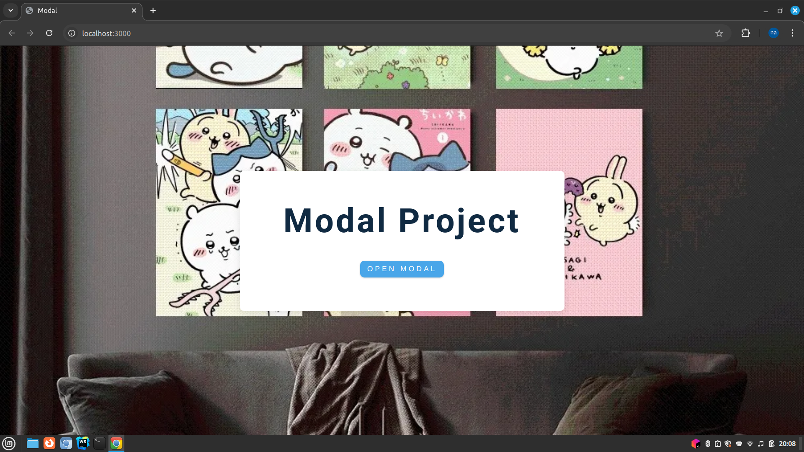
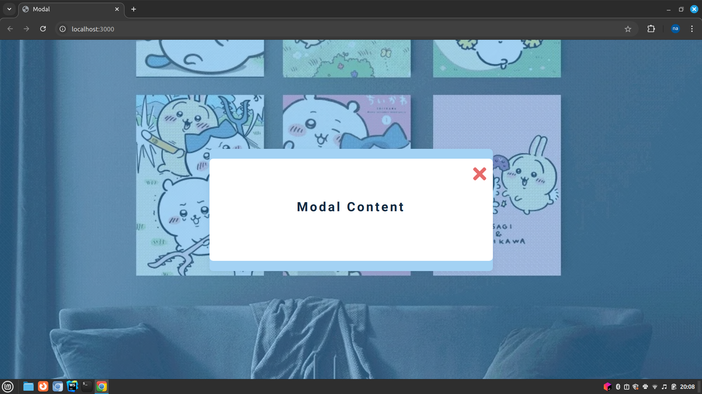

# Modal Project
Overview
The Modal Project is a simple implementation of a modal popup using HTML, CSS, and JavaScript. It features a button that opens a modal overlay with content and a close button to dismiss the modal.

# Features

```
Open Modal: A button on the page triggers the modal overlay to appear.

Close Modal: A button inside the modal allows users to close the modal overlay.
```

# Usage

```
Open Modal: Click the "Open modal" button to display the modal overlay.

Close Modal: Click the close button (×) within the modal to hide it.
```

# Screenshot




